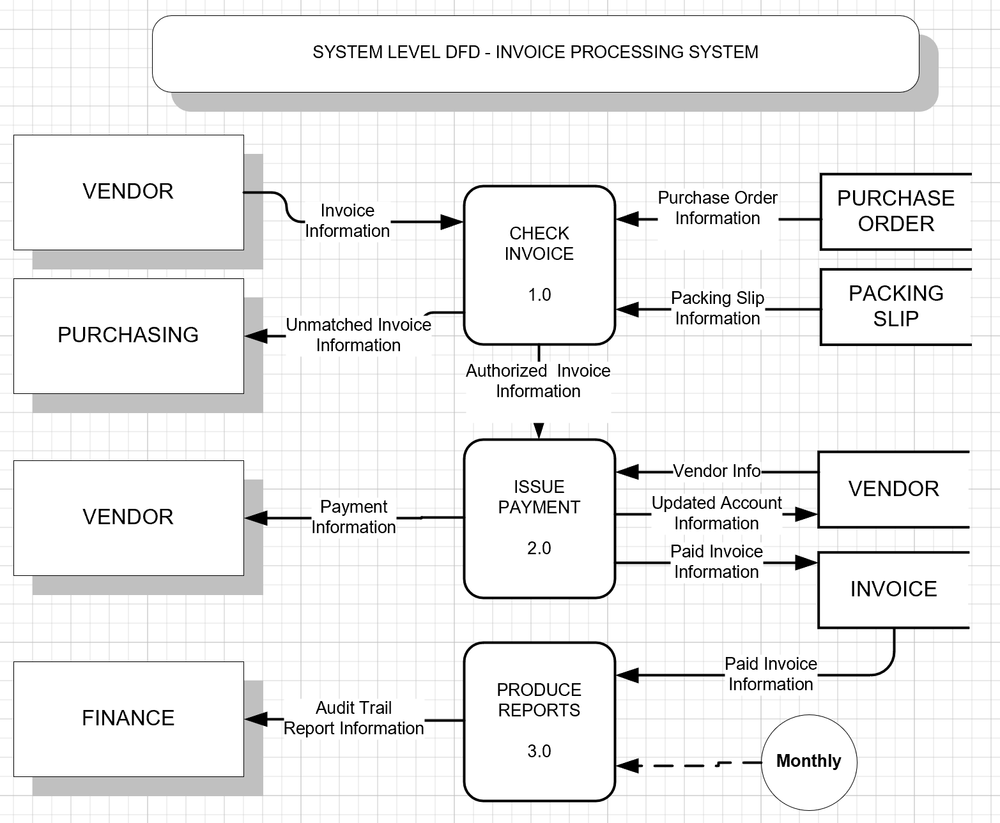

Invoices arrive from various vendors daily. This triggers the following events that take place within the Accounts Payable Department. The information on the invoice is checked against the original purchase order and original packing slip. The purchase order contains the packing slip number from which the original packing slip can be retrieved. Both of these documents are retrieved from separate file folders in the file cabinet in the Purchasing Department. If the information matches, the invoice is then authorized for payment. If the information does not match then the invoice is rejected, and is sent to the Purchasing Department to be reprocessed at a later date with another system.

If the invoice is authorized for payment then a cheque issued to the vendor. The Vendor’s account balance is updated with the amount paid on the invoice. The invoice is then stamped “paid” and filed within the Accounts Payable Department.

 The Accounts Payable clerk is responsible for producing a listing of all invoices paid. This Audit Trail report is then sent to the Finance Managers at the end of every month for reconciliation purposes.

## Required: SDLC (System Development Life Cycle)
1.	`ADEPT` (Activities, Data, Environment, People, Technology) Framework 
2.	`Context DFD` (Data Flow Diagram)
3.	`System DFD` (Data Flow Diagram)
4.	`System Level Data Flow Narratives`
5.	`ERD` (Entity Relationship Diagram)

## SOLUTION

### ADEPT

Activities/Processes
- Check Invoice (1.0)
- Issue Payment (2.0)
- Produce Reports (3.0)

Data (Information Sources)
- Invoice
- Purchase Order
- Packing Slip
- Vendor

Environment
- Products/Services
  - Invoice Tracking
- Nature of Industry
  - Year Round, Not enough info

People
  - External
    - Vendors
    - Purchasing Department
    - Finance Department
  - Internal
    - Accounts Payable Department

Technology
  - Mix of Manual and Electronic Processes

#### [Exercise Home](../index.md)
