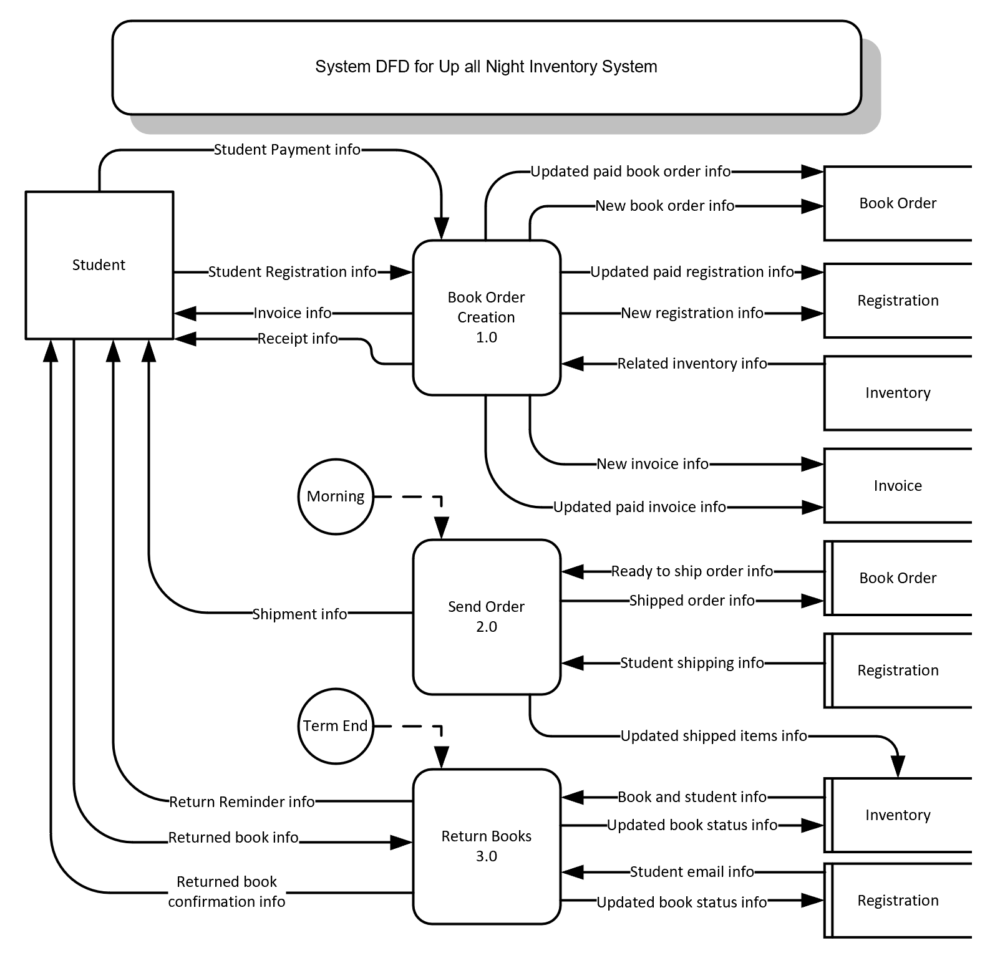

The Online school `Up All Night` has an inventory of books students will borrow for their courses.  These books are shipped to the student. The student is expected to return the books at the end of the school year.

When a student registers for a class there is a list of books that go with each course. In the inventory file, for each book there is a field that will designate which course the book is associated with. If a student creates a registration for a particular course, the system will store the registration info for future reference. Also the system will pull up all active inventory items (books) associated with that course. A new book order is created for each book related to the course. An invoice is sent to the student for all classes registered in, and invoice info is stored for future reference. The student will pay for their registered courses before anything else proceeds. The cost of each course includes a component for the borrowed books for the course, with a built in risk factor that some or all of the borrowed books may not be returned. Upon payment a receipt is issued to the student, and the invoice info is updated to a status of "paid". Also upon payment, registration info is updated to a status of "paid-registration". Finally, upon payment, each related book order is updated to a status of "paid-book-order" meaning that the book is "ready-to-ship" to the student.

Every morning, Shipping and Receiving will pull up the book orders that are ready to be shipped to each student.  Each book order is picked, packed and shipped to a particular student via shipping info in the registration file. The book order status is then changed to "shipped". Inventory items are then updated to show which items are with a particular student. A separate system is used to order books from suppliers. It is assumed that all required books are available and in inventory.

When the term is done, the books are expected to be returned. A reminder email is sent to each student to return borrowed books. The books will arrive at the shipping and receiving office where each book bar code is scanned.  The student that the books are assigned to, will come up on the screen. Each book is evaluated as "returned" or “written off” if not in good condition. The inventory file is then updated to reflect each borrowed book as "not returned", "returned and available", or "written off".  There are no consequences for a student if a book is not returned, or is returned in bad condition. The course cost was calculated with a risk factor that included the fact that a student may possibly not return any books. The students registration info is updated as having returned which books in good condition, which books in bad condition, or which borrowed books have not been returned. The student is then sent an email confirming the status of all borrowed books.

## Required: SDLC (System Development Life Cycle)
1.	`ADEPT` (Activities, Data, Environment, People, Technology) Framework 
2.	`Context DFD` (Data Flow Diagram)
3.	`System DFD` (Data Flow Diagram)
4.	`System Level Data Flow Narratives`
5.	`ERD` (Entity Relationship Diagram)

## SOLUTION

### ADEPT

Activities/Processes
- Book Order Creation (1.0)
- Send Orders (2.0)
- Return Books (3.0)

Data (Information Sources)
- Registration
- Inventory
- Book Order
- Invoice

Environment
- Products/Services
  - Inventory Management System
  - Competition - other book stores
- Nature of Industry
  - Year Round, Private

People
  - External
    - Student
  - Internal
    - Shipping and Receiving

Technology
  - Mix of Manual and Electronic Processes

#### [Exercise Home](../index.md)