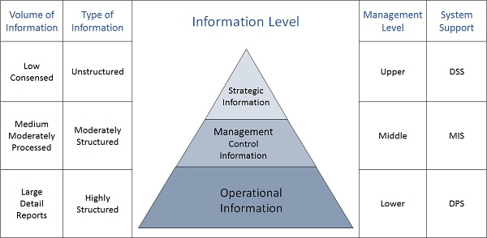

# Definitions

- [source: tutorialspoint.com](https://www.tutorialspoint.com/system_analysis_and_design/index.htm)

#### Information Systems Hierarchy

- EIS - Executive Information System
  - KMS - Knowledge Management System - Expert/AI
- DSS - Decision Support System
  - can perform "what-if" scenarios
- MIS - Management Information System
- OSS - Office Support System
- TPS - Transaction Processing System

---

- ECS - Enterprise Computing Systems
  - support company-wide operations
  - ERP - Enterprise Resource Planning Software
    - Oracle NetSuite
    - Microsoft Dynamics 365
    - SAP Business One

#### [Theory Home](index.md)
#### [ANAP1525 Home](../index.md)