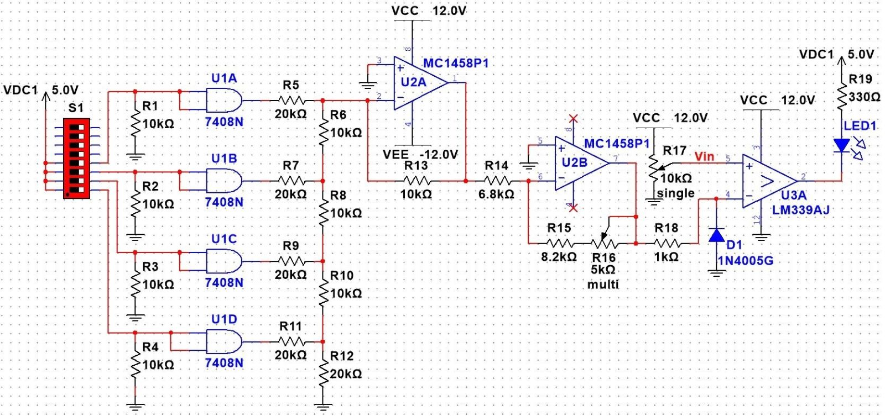

## SAR Example 1

|   |   |   |   |
|---|---|---|---|
|Given Info||||
|Symbol|Description|Result|Units|
|Vref||5.0|V|
|n|number of bits|4||
|Av_S2|inverting|1.6|V|
|Analog_In||2.4|V|
|||||
|Solution||||
|Symbol|Formula|Result|Units|
|Step_S1|Vref/power(2,n)|||
||5.0/power(2,4)|312.50E-3|V|
|Step_Tot|(Step_S1)(Av_S2)||V|
||(312.50E-3)(1.6)|500.00E-3|V|
|||||
|Decimal|Binary|DAC_Out||
|0|0000|0|V|
|1|0001|0.500|V|
|2|0010|1.000|V|
|3|0011|1.500|V|
|4|0100|2.000|V|
|5|0101|2.500|V|
|6|0110|3.000|V|
|7|0111|3.500|V|
|8|1000|4.000|V|
|9|1001|4.500|V|
|10|1010|5.000|V|
|11|1011|5.500|V|
|12|1100|6.000|V|
|13|1101|6.500|V|
|14|1110|7.000|V|
|15|1111|7.500|V|
|||||
|SAP|DAC_Out|Decision||
|1000|4.000|dont-keep||
|0100|2.000|keep||
|0110|3.000|dont-keep||
|0101|2.500|dont-keep||

## SAR Example 2

|   |   |   |   |
|---|---|---|---|
|Given Info||||
|Symbol|Description|Result|Units|
|Vref||5.0|V|
|n|number of bits|4||
|Av_S2|inverting|2.0|V|
|Analog_In||8.2|V|
|||||
|Solution||||
|Symbol|Formula|Result|Units|
|Step_S1|Vref/power(2,n)|||
||5.0/power(2,4)|312.50E-3|V|
|Step_Tot|(Step_S1)(Av_S2)||V|
||(312.50E-3)(2.0)|625.00E-3|V|
|||||
|Decimal|Binary|DAC_Out||
|0|0000|0|V|
|1|0001|0.625|V|
|2|0010|1.250|V|
|3|0011|1.875|V|
|4|0100|2.500|V|
|5|0101|3.125|V|
|6|0110|3.750|V|
|7|0111|4.375|V|
|8|1000|5.000|V|
|9|1001|5.625|V|
|10|1010|6.250|V|
|11|1011|6.875|V|
|12|1100|7.500|V|
|13|1101|8.125|V|
|14|1110|8.750|V|
|15|1111|9.375|V|
|||||
|SAP|DAC_Out|Decision||
|1000|5.000|keep||
|1100|7.500|keep||
|1110|8.750|dont-keep||
|1101|8.125|keep||