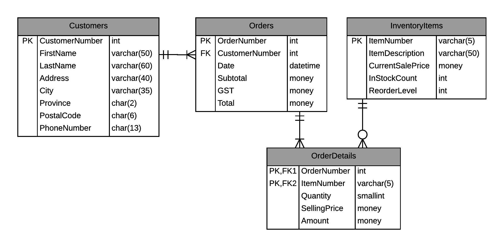
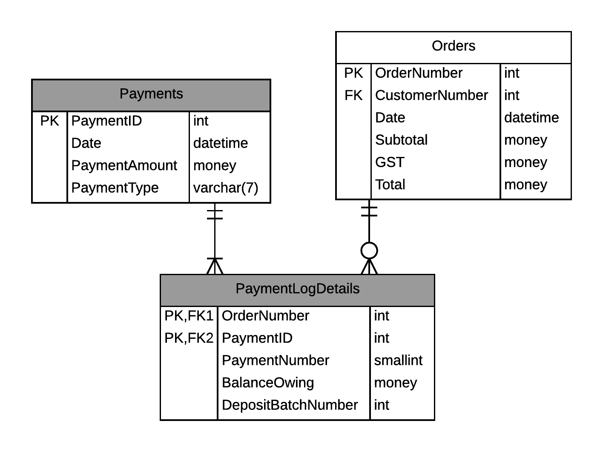
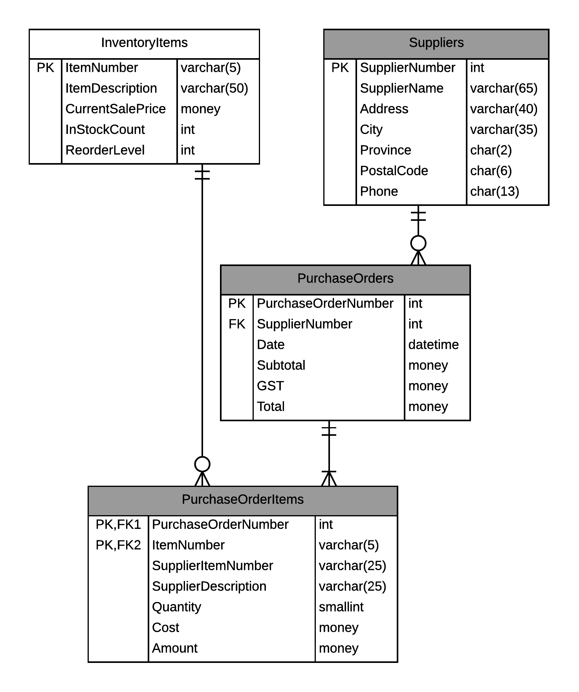
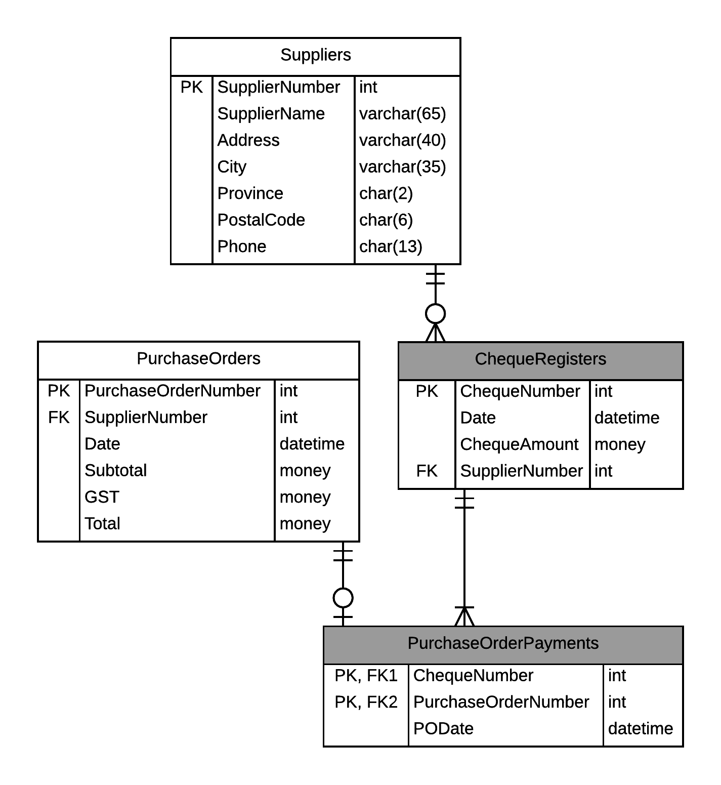
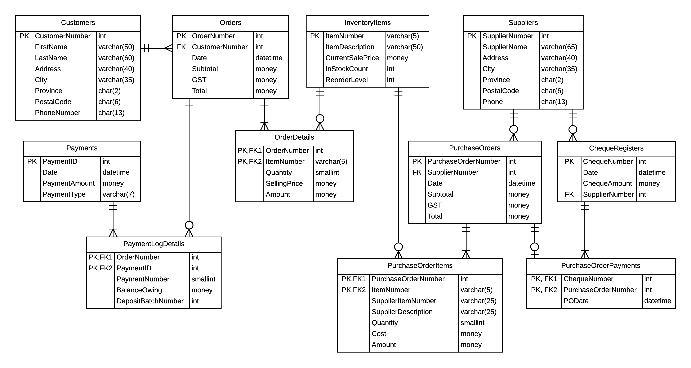

# Emergency Service Providers - Demo

The sample scenario for Emergency Service Providers (ESP) is an excellent example for coding a script file to create the database. The following documentation specifies four stages to the development for the ESP database. Each stage "builds" on previous stages, and as such, should assume that there may be data inserted into tables of the previous stage.

## Stage 1 - Customers, Orders, and Inventory

- **Customers** - Primary key must be an Identity, starting at 100 and increasing by one.
  - `Customers.Province` - Defaults to 'AB' and must be one of the provinces/territories of Canada.
  - `Customers.PostalCode` - Must follow the pattern for Canadian postal codes (A9A9A9).
  - `Customers.PhoneNumber` - Must be in the format of (###)###-####.
- **Orders** - Primary key must be an Identity, starting at 200 and increasing by one.
  - `Orders.Subtotal` - Must be greater than zero.
  - `Orders.GST` - Must be greater than or equal to zero.
  - `Orders.Total` - Sum of Subtotal and GST.
- **InventoryItems**
  - `InventoryItems.CurrentSalePrice` - Must be greater than zero.
- **OrderDetails**
  - `OrderDetails.Quantity` - Defaults to 1 and must be greater than zero.
  - `OrderDetails.SellingPrice` - Must be greater than or equal to zero.
  - `OrderDetails.Amount` - Product of Quantity and SellingPrice.

## Stage 2 - Payments and Payment Logs

- **Payments** - Primary key must be an Identity, starting at 1 and increasing by one.
  - `Payments.PaymentAmount` - Must be greater than zero.
  - `Payments.PaymentType` - Must be either 'Cash', 'Cheque' or 'Credit'.
- **PaymentLogDetails**
  - `PaymentLogDetails.BalanceOwing` - Cannot be negative.

## Stage 3 - Suppliers and Purchase Orders

- **Suppliers** - Primary key must be an Identity, starting at 100 and increasing by one.
  - `Suppliers.Province` - Must be one of the provinces/territories of Canada.
  - `Suppliers.PostalCode` - Must follow the pattern for Canadian postal codes (A9A9A9).
  - `Suppliers.Phone` - Must be in the format of (###)###-####.
- **PurchaseOrders** - Primary key must be an Identity, starting at 1 and increasing by one.
  - `PurchaseOrders.Subtotal` - Must be greater than zero.
  - `PurchaseOrders.GST` - Must be greater than or equal to zero.
  - `PurchaseOrders.Total` - Sum of Subtotal and GST.
  - `PurchaseOrderItems.Quantity` - Defaults to 1 and must be greater than zero.
  - `PurchaseOrderItems.Cost` - Must be greater than or equal to zero.
  - `PurchaseOrderItems.Amount` - Product of Quantity and Cost.

## Stage 4 - Payments to Suppliers

- **ChequeRegisters**
  - `ChequeRegisters.ChequeAmount` - Must be greater than zero.

## Summary

