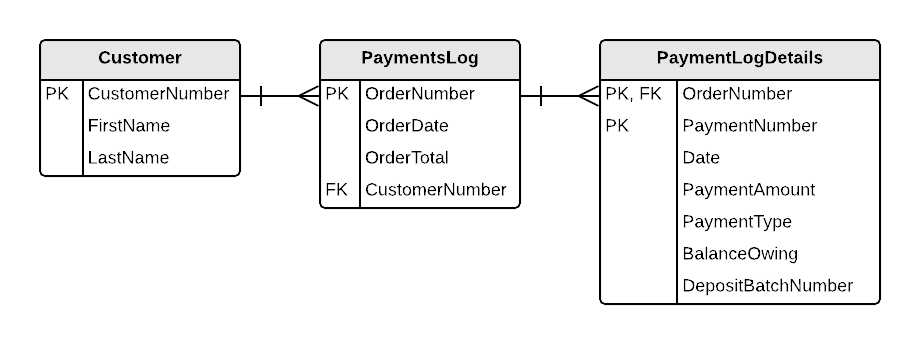

# Merging ERDs

In the [specs for the first part](ESP-1-Specs.md) for ESP database design, two views were analyzed and ERDs generated for each of them.

Customer Details View | Customer Orders View
----------------------|---------------------
 | 

The **Customer** entity that appears in both ERDs is essentially the same, having only minor differences in the naming of some attributes. As such, merging the two ERDs produces the same result as the ERD from the *Customer Orders View*.

The ERD from the [second part](ESP-2-Specs.md) has some overlap and a more thoughtful merging is required to produce a single comprehensive ERD.

ESP Part 1 ERD | Payment Log View
----------------------|---------------------
 | 

The **Customer** entity from both ERDs are essentially the same. The second version of **Customer** appears to just be a subset of the first version, with some minor differences in attribute names. As such, the larger **Customer** entity will be used for the merged ERD.

The remaining entities from the two ERDs have different names, but upon closer examination it would appear that the **Order** and **PaymentsLog** entities are actually the *same* entity, just with different names. How did we make that determination? It was made based in part upon the **primary keys** of the two entities: ***OrderNumber***. It's not just that these keys have the same name; rather, it's that they they refer to the same *concept* in the business - an identifier for a *Customer Order*. So, in essence, the **PaymentsLog** identifies the *Customer Order* against which a payment is made. With this discovery, the remaining attributes can be compared and are found to be similar with minor differences in their names. The **Order** entity already contains all the attributes described in the **PaymentsLog**, so the larger **Order** entity will be used for the merged ERD.

The final entities - **OrderDetail**, **Item**, and **PaymentLogDetails** - all appear to be distinct, so they will be included in the merged ERD as-is.

